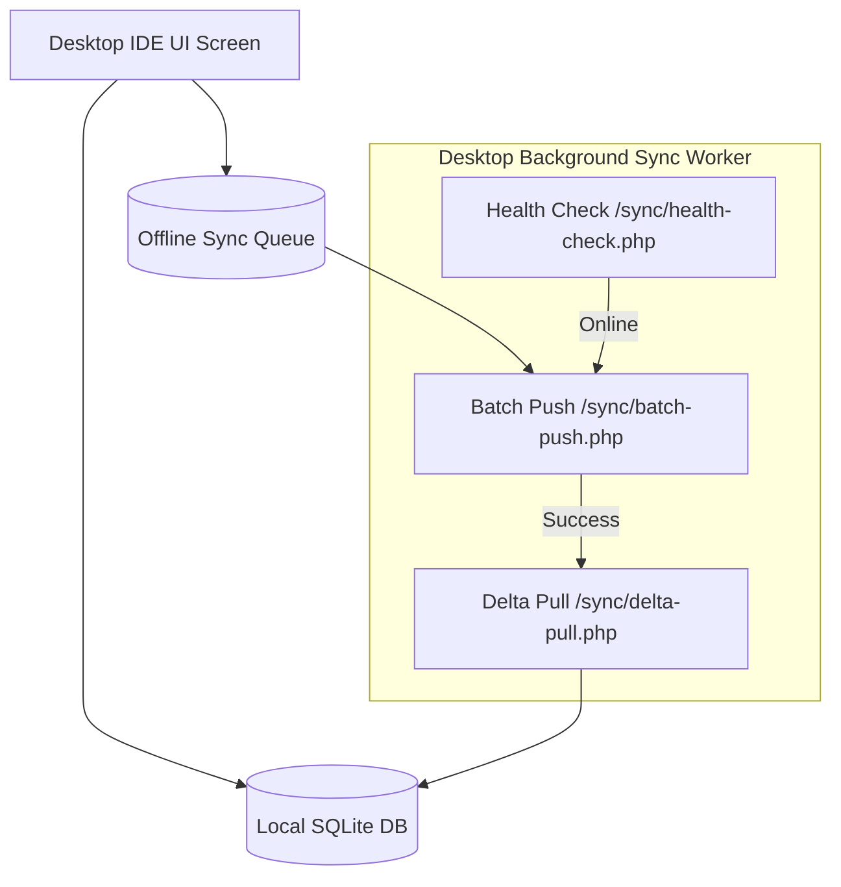

# EIMBox Desktop IDE — Backend Integration & Architecture Guide

> **Document Purpose:** This document serves as the master contract and architectural guide for the **EIMBox Desktop IDE** (built with Electron, Flutter Desktop, Tauri, or C#/.NET). Copy this file directly into the root of your Desktop IDE repository (e.g., as `API_INTEGRATION.md` or `BACKEND_SPECS.md`). Any AI assistant or developer reading this will have complete context on how to communicate with the EIMBox central REST API backend.

---

## 1. Core Connection & Communication Standards

### 1.1 Base URLs
- **Local Dev:** `http://localhost/eimbox-dashboard/eimbox-materio/api/v1`
- **Production Cloud:** `https://your-eimbox-domain.com/api/v1`

### 1.2 Unified Headers
All API requests from the Desktop client must include:
```http
Content-Type: application/json
Accept: application/json
Authorization: Bearer <JWT_AUTH_TOKEN>
```
*(Note: Authentication endpoints `/auth/login.php` and `/sync/health-check.php` do not require the `Authorization` header).*

### 1.3 Unified Response Envelope
Every backend API returns JSON in the following standard envelope:
```json
{
  "status": "success", // or "error"
  "message": "Operation completed successfully.",
  "timestamp": "2026-08-21 11:30:00",
  "data": {
    /* Response payload object or array */
  }
}
```

---

## 2. Desktop Local Architecture & Offline First Strategy



### 2.1 Recommended Desktop SQLite Tables
1. **`app_config`** — Stores `sccode`, `auth_token`, `device_uuid`, `last_sync_timestamp`, `printer_name`.
2. **`students_cache`** — Local replica of students, rolls, class, section, guardian mobile, dues.
3. **`sync_queue`** — Pending offline transactions (`queue_id`, `module_name`, `action_type`, `payload_json`, `created_at`, `status`).

---

## 3. Complete REST API Specifications by Module

---

### Module 1: Auth & Hardware Binding

#### 1.1 User / Student Login
- **Endpoint:** `POST /auth/login.php`
- **Payload:**
  ```json
  {
    "email": "user@school.com", // or student username / mobile / STID
    "password": "yourpassword",
    "login_type": "user" // or "student"
  }
  ```
- **Success Response:**
  ```json
  {
    "status": "success",
    "data": {
      "token": "eyJhbGciOiJIUzI1NiIs...",
      "user": {
        "id": 1,
        "username": "admin",
        "email": "user@school.com",
        "sccode": 103187,
        "role": "Super Admin",
        "profilename": "Reaz"
      },
      "school": {
        "sccode": 103187,
        "name": "Model High School",
        "package_id": 2
      }
    }
  }
  ```

#### 1.2 Device Hardware Binding
- **Endpoint:** `POST /auth/device-bind.php`
- **Payload:**
  ```json
  {
    "sccode": 103187,
    "hw_uuid": "MAC-OR-MOTHERBOARD-UUID-HASH",
    "device_name": "Front Desk Billing Counter 1"
  }
  ```

#### 1.3 Authenticated User Profile
- **Endpoint:** `GET /auth/me.php`

#### 1.4 Change Password
- **Endpoint:** `POST /auth/change-password.php`
- **Payload:**
  ```json
  {
    "current_password": "old_password",
    "new_password": "new_secure_password"
  }
  ```

#### 1.5 Teachers & Staff Directory
- **Endpoint:** `GET /users/teachers-list.php?sccode={sccode}&status=Active`
- **Returns:** List of teachers (`tid`, `name_eng`, `name_ben`, `designation`, `mobile`, `photo_url`).

---

### Module 2: Academics & Routine

#### 2.1 Academic Structure (Hierarchy)
- **Endpoint:** `GET /academics/structure.php?sccode={sccode}&session=2026`
- **Returns:** Full tree of slots (Morning/Day), classes, sections, subjects, and exam terms.

#### 2.2 Students Pull (with Dues)
- **Endpoint:** `GET /academics/students-pull.php?sccode={sccode}&session=2026&class=Class 6&section=A`
- **Returns:** Students list with `stid`, `rollno`, `name_eng`, `name_ben`, `guarmobile`, `total_dues`, `photo_url`.

#### 2.3 Comprehensive Student Profile
- **Endpoint:** `GET /academics/student-details.php?sccode={sccode}&stid={stid}`
- **Returns:** Detailed bio, parents' details, village/district addresses, recent payment history.

#### 2.4 Class Routine & Timetable
- **Endpoint:** `GET /academics/class-routine.php?sccode={sccode}&session=2026&class=Class 6&section=A`
- **Returns:** Period timings and day-by-day teacher-subject allocation.

#### 2.5 Subjects Catalog & Rules
- **Endpoint:** `GET /academics/subjects-list.php?sccode={sccode}&class=Class 6`

---

### Module 3: Finance, POS Billing & Cashbook

#### 3.1 Student Dues Breakdown
- **Endpoint:** `GET /finance/student-dues.php?sccode={sccode}&stid={stid}&session=2026`
- **Returns:** Itemized unpaid fee list (`id`, `particulareng`, `month`, `amount`, `dues`), last payment date, and suggested next `suggested_next_prno`.

#### 3.2 Collect Fee & Issue Money Receipt (PR)
- **Endpoint:** `POST /finance/collect-fee.php`
- **Payload:**
  ```json
  {
    "sccode": 103187,
    "stid": "1031870001",
    "prno": 1052,
    "sessionyear": 2026,
    "classname": "Class 6",
    "sectionname": "A",
    "rollno": 5,
    "items": [
      { "id": 101, "paid": 500 },
      { "id": 102, "paid": 200 }
    ],
    "collection_media": "Cash" // or "bKash" / "Nagad" / "Bank"
  }
  ```
- **Returns:** Receipt metadata + `print_payload` (formatted receipt text ready to send directly to 58mm/80mm ESC/POS USB thermal printers).

#### 3.3 Daily Collection Ledger
- **Endpoint:** `GET /finance/daily-collection.php?sccode={sccode}&date=YYYY-MM-DD`
- **Returns:** Receipts list, total amount collected, summary by cash/mobile media, and collector totals.

#### 3.4 Institutional Fee Heads
- **Endpoint:** `GET /finance/fee-heads.php?sccode={sccode}&session=2026`

#### 3.5 Cashbook Income/Expense Voucher Entry
- **Endpoint:** `POST /finance/cashbook-entry.php`
- **Payload:**
  ```json
  {
    "sccode": 103187,
    "date": "2026-08-21",
    "type": "Expense", // or "Income"
    "account_head_id": 1,
    "sub_head_id": 3,
    "particulars": "Office Electricity Bill",
    "amount": 1450.00,
    "memono": 104
  }
  ```

---

### Module 4: Examinations & Tabulation

#### 4.1 Bulk Marks Entry (with Auto-Grading)
- **Endpoint:** `POST /exams/mark-entry-bulk.php`
- **Payload:**
  ```json
  {
    "sccode": 103187,
    "sessionyear": 2026,
    "exam": "Half Yearly",
    "classname": "Class 6",
    "sectionname": "A",
    "subcode": 101,
    "fullmark": 100,
    "marks": [
      { "stid": "1031870001", "subj": 55, "obj": 25, "pra": 0, "ca": 0 },
      { "stid": "1031870002", "subj": 42, "obj": 18, "pra": 0, "ca": 0 }
    ]
  }
  ```
*(The backend automatically computes total marks, percentage, GPA 0-5.0, and Grade Letter A+/A/A-/B/C/D/F).*

#### 4.2 Marks Sheet Grid
- **Endpoint:** `GET /exams/marks-sheet.php?sccode={sccode}&session=2026&exam=Half Yearly&class=Class 6&section=A`

#### 4.3 Tabulation Sheet & Result Analytics
- **Endpoint:** `GET /exams/tabulation-data.php?sccode={sccode}&session=2026&exam=Half Yearly&class=Class 6`
- **Returns:** Full class merit list, GPA, GPA with 4th subject, pass rate, failed count, and grade distribution chart data.

#### 4.4 Admit Card / Roll Slip Data
- **Endpoint:** `GET /exams/admit-card-data.php?sccode={sccode}&session=2026&exam=Half Yearly&class=Class 6`

---

### Module 5: Attendance (Students & Teachers)

#### 5.1 Push Student Attendance (Biometric / Manual)
- **Endpoint:** `POST /attendance/attendance-push.php`
- **Payload:**
  ```json
  {
    "sccode": 103187,
    "date": "2026-08-21",
    "records": [
      { "stid": "1031870001", "status": 1, "in_time": "08:55:00" },
      { "stid": "1031870002", "status": 0, "in_time": null }
    ]
  }
  ```

#### 5.2 Daily Attendance Register Sheet
- **Endpoint:** `GET /attendance/daily-sheet.php?sccode={sccode}&session=2026&date=YYYY-MM-DD&class=Class 6&section=A`

#### 5.3 Push Teacher & Staff Attendance
- **Endpoint:** `POST /attendance/teacher-push.php`
- **Payload:**
  ```json
  {
    "sccode": 103187,
    "date": "2026-08-21",
    "records": [
      { "tid": 10318701, "realin": "08:45:00", "realout": "14:10:00", "statusin": "Present" }
    ]
  }
  ```

#### 5.4 Monthly Attendance Percentage Summary
- **Endpoint:** `GET /attendance/monthly-summary.php?sccode={sccode}&month=8&year=2026&class=Class 6`

---

### Module 6: SMS & Notices

#### 6.1 Send SMS (Single or Bulk)
- **Endpoint:** `POST /sms/send-sms.php`
- **Payload:**
  ```json
  {
    "sccode": 103187,
    "message": "Dear Guardian, School will remain closed tomorrow.",
    "recipients": ["01711000000", "01811000000"],
    "sms_type": "Notice",
    "campaign": "Holiday Broadcast"
  }
  ```

#### 6.2 SMS Balance & Dispatch History
- **Endpoint:** `GET /sms/balance.php?sccode={sccode}`

#### 6.3 Notice Board
- **Endpoint:** `GET /notices/notices-list.php?sccode={sccode}&limit=20`

---

### Module 7: Settings & Grading

#### 7.1 School Profile
- **Endpoint:** `GET /settings/school-profile.php?sccode={sccode}`

#### 7.2 NCTB GPA Grading Scale
- **Endpoint:** `GET /settings/gpa-rules.php?sccode={sccode}`

---

### Module 8: 2-Way Offline Sync & Health Check

#### 8.1 Ping & Health Check
- **Endpoint:** `GET /sync/health-check.php`
- **Use:** Call on desktop startup and every 60s in the background to detect online/offline status and server latency.

#### 8.2 Incremental Delta Pull (Server to Desktop)
- **Endpoint:** `GET /sync/delta-pull.php?sccode={sccode}&last_sync_timestamp=YYYY-MM-DD HH:MM:SS`
- **Returns:** Newly modified students, marks, dues, and attendance records since `last_sync_timestamp`.

#### 8.3 Batch Push Offline Queue (Desktop to Server)
- **Endpoint:** `POST /sync/batch-push.php`
- **Payload:**
  ```json
  {
    "sccode": 103187,
    "transactions": [
      {
        "queue_id": 101,
        "module_name": "attendance",
        "action_type": "ATTEND",
        "payload": {
          "date": "2026-08-21",
          "records": [{ "stid": "1031870001", "status": 1, "in_time": "08:50:00" }]
        }
      },
      {
        "queue_id": 102,
        "module_name": "finance",
        "action_type": "FEE_COLLECT",
        "payload": {
          "stid": "1031870001",
          "prno": 1055,
          "items": [{ "id": 101, "paid": 500 }]
        }
      }
    ]
  }
  ```
- **Returns:** Itemized sync status (`queue_id`, `status: "synced"` or `status: "failed"`, `error`).
