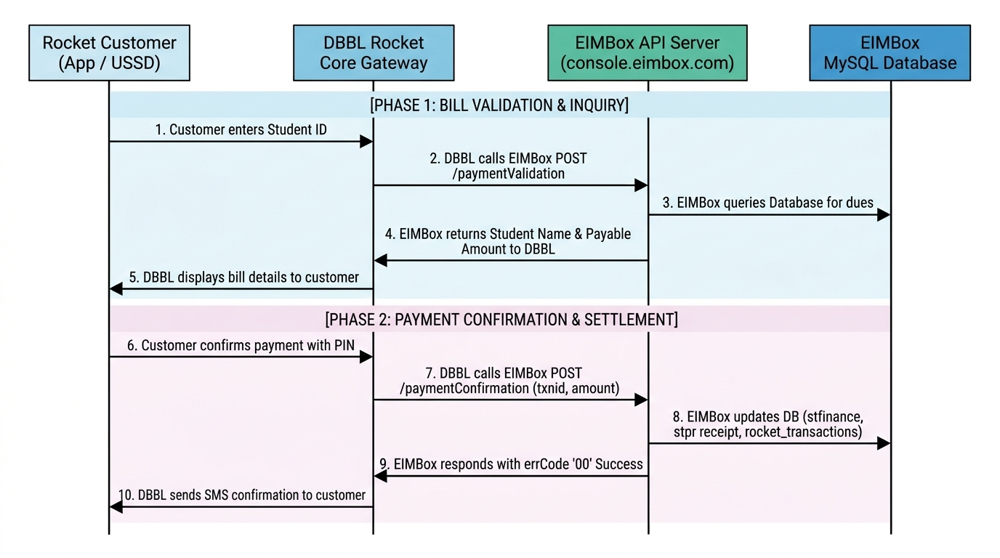
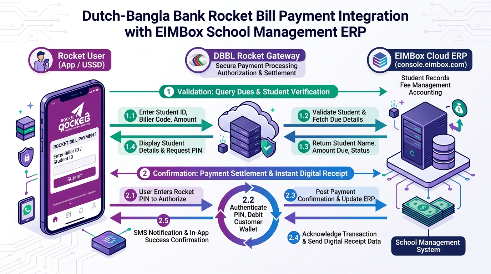

# EIMBox - DBBL Rocket Bill Payment Integration Specification

**Document Version:** 1.1  
**Target Audience:** DBBL Rocket Technical Integration Team, Aggregator Developers, System Administrators  
**Protocol:** HTTPS / REST (JSON)  
**Production Base URL:** `https://console.eimbox.com/api/payment/v1/`  
**Staging / Test URL:** `http://localhost/eimbox-dashboard/eimbox-materio/api/payment/v1/`  
**Standard Compliance:** Dutch-Bangla Bank Limited (DBBL) Bill Payment Module Specification v1.1  

---

## 1. Overview & Architecture

The **EIMBox Educational Institution Management System** provides automated student fee settlement and billing integration for **Dutch-Bangla Bank Limited (DBBL) Rocket Mobile Banking**.

Through this integration:
1. Guardians or students select the EIMBox Biller in their **Rocket Mobile App** or dial **USSD (*322#)**.
2. The user inputs their Student ID / Reference Number.
3. Rocket queries the EIMBox **Validation API**, which dynamically calculates real-time unpaid dues and returns the student's name, class, section, roll, and payable amount.
4. Upon user confirmation and successful pin verification in the Rocket engine, Rocket dispatches a transaction notification to the EIMBox **Confirmation API**, which instantly updates the student finance ledger (`stfinance`), issues a receipt voucher (`stpr`), and logs transaction audit trails.
5. In case of network timeout or reconciliation, Rocket's automated batch scheduler calls the **Inquiry API** to verify settlement status.






```
┌──────────────┐                 ┌──────────────────────┐                 ┌──────────────────┐
│              │ 1. Validation   │                      │ Query Dues      │                  │
│ Rocket User  │────────────────▶│   Rocket Gateway     │────────────────▶│  EIMBox Server   │
│ (App / USSD) │◀────────────────│   (DBBL Server)      │◀────────────────│  (console.       │
│              │ Shows Amount    │                      │ Name + Dues     │   eimbox.com)    │
│              │                 │                      │                 │                  │
│              │ 2. Pay Bill     │                      │ Post Txn        │                  │
│              │────────────────▶│                      │────────────────▶│ Settle stfinance │
│              │ Success SMS     │                      │◀────────────────│ Generate Receipt │
│              │◀────────────────│                      │ Confirmed (00)  │                  │
└──────────────┘                 └──────────────────────┘                 └──────────────────┘
```


---

## 2. Security & Authentication

Communication between DBBL Rocket and EIMBox must be over **TLS 1.2+ (HTTPS)**.

### 2.1 HTTP Basic Authentication Header
Every HTTP request must include the `Authorization` header containing the Base64-encoded credentials:
```http
Authorization: Basic <base64_encode(User_ID:Password)>
Content-Type: application/json; charset=UTF-8
```

### 2.2 Payload Credentials
As mandated by the DBBL specification, requests also transmit user credentials directly in the JSON body:
* `usrid` / `userid`: Biller User ID
* `pswrd` / `password`: Biller Password

### 2.3 Authentication Models Supported:
* **Global Aggregator Model (Default):** All requests authenticated against central DBBL Biller partner credentials (`Rocket` / `Rocket123`).
* **Multi-Tenant / Per-Institute Model:** For institutions holding independent Biller IDs with DBBL, the gateway checks the `payment_gateway_keys` table matching `biller_id`, `api_key`, and `secret_key` against the specific `sccode`.

---

## 3. Reference Parameters Convention

DBBL Rocket provides 3 reference fields (`refNo1`, `refNo2`, `refNo3`). EIMBox handles standard flexible mapping:

| Parameter | Data Type | Requirement | Description | Accepted Formats |
|---|---|---|---|---|
| `refNo1` | Alpha-Numeric (25) | **Mandatory** | Primary Student Identifier | • `sccode-stid` (e.g. `1001-10502`)<br>• Student ID only (e.g. `10502`) |
| `refNo2` | Alpha-Numeric (25) | Optional | Institution Code (`sccode`) | If `refNo1` contains only Student ID, `refNo2` specifies the school code (e.g. `1001`). |
| `refNo3` | Alpha-Numeric (25) | Optional | Academic Session Year | Academic Year (e.g. `2026`). Defaults to active academic year if left blank. |

---

## 4. API Endpoints Specification

### 4.1 Validation API (`/paymentValidation`)

Validates student existence, queries real-time dues from `stfinance`, and returns the student name and exact amount payable.

* **Endpoint URL:** `https://console.eimbox.com/api/payment/v1/paymentValidation`  
* **HTTP Method:** `POST`  
* **Type:** Amount Provided from Partner API (DBBL Doc Section 4.2.b)

#### Request Fields:
| Parameter | Type | Required | Description |
|---|---|---|---|
| `usrid` | String | Yes | Biller User ID |
| `pswrd` | String | Yes | Biller Password |
| `refNo1` | String | Yes | Student Reference (e.g. `1001-10502`) |
| `refNo2` | String | No | Institution Code (`sccode`) if not in `refNo1` |
| `refNo3` | String | No | Session Year (e.g. `2026`) |

#### Sample Request:
```json
{
  "usrid": "Rocket",
  "pswrd": "Rocket123",
  "refNo1": "1001-10502",
  "refNo2": "",
  "refNo3": "2026"
}
```

#### Response Fields:
| Parameter | Type | Description |
|---|---|---|
| `errCode` | String | `00` on success; error code on failure |
| `errMsg` | String | Status description message |
| `customerName` | String | Student Full Name (from `students.stnameeng`) |
| `optionalInfo1` | String | Student Class and Section (from `sessioninfo`) |
| `optionalInfo2` | String | Student Roll Number and Academic Session |
| `optionalInfo3` | String | Institution Code / Biller Info |
| `amount` | String | Total calculated unpaid dues |

#### Sample Success Response (`200 OK`):
```json
{
  "errCode": "00",
  "errMsg": "Successful",
  "customerName": "RAKIBUL HASAN",
  "optionalInfo1": "Class: Nine (A)",
  "optionalInfo2": "Roll: 05 | Year: 2026",
  "optionalInfo3": "Institute SC: 1001",
  "amount": "1500"
}
```

#### Sample Error Response (`200 OK`):
```json
{
  "errCode": "01",
  "errMsg": "Student Not Found for given ID and Institution"
}
```

---

### 4.2 Confirmation API (`/paymentConfirmation`)

Dispatched by DBBL Rocket immediately after the user confirms payment. Settles student finance ledgers, generates receipt record (`stpr`), and logs audit entry.

* **Endpoint URL:** `https://console.eimbox.com/api/payment/v1/paymentConfirmation`  
* **HTTP Method:** `POST`  
* **DBBL Doc Reference:** Section 4.1.b & 4.2.c

#### Request Fields:
| Parameter | Type | Required | Description |
|---|---|---|---|
| `userid` | String | Yes | Biller User ID |
| `password` | String | Yes | Biller Password |
| `txnid` | String (15-60) | Yes | DBBL Rocket Unique Transaction ID |
| `txndate` | String (25) | No | Transaction Timestamp (e.g. `11-Sep-2026 04:50:00 AM`) |
| `refno1` | String | Yes | Student Reference |
| `refno2` | String | No | School Code / Secondary Reference |
| `refno3` | String | No | Session Year |
| `amount` | Numeric | Yes | Paid Amount in BDT |

#### Sample Request:
```json
{
  "userid": "Rocket",
  "password": "Rocket123",
  "txnid": "DBBL202609110001",
  "txndate": "11-Sep-2026 04:50:00 AM",
  "refno1": "1001-10502",
  "refno2": "",
  "refno3": "2026",
  "amount": "1500"
}
```

#### Idempotency & Duplicate Protection:
If Rocket sends a retry with the same `txnid`, EIMBox verifies existing records in `rocket_transactions`. If already applied, it **does not deduct dues twice**; instead, it immediately returns `errCode: "00"` with `Payment Information Updated Successfully`.

#### Sample Success Response (`200 OK`):
```json
{
  "errCode": "00",
  "errMsg": "Payment Information Updated Successfully"
}
```

---

### 4.3 Inquiry API (`/getPaymentStatus`)

Used by the DBBL Rocket automated scheduler to verify transaction settlement status during timeouts or network drops.

* **Endpoint URL:** `https://console.eimbox.com/api/payment/v1/getPaymentStatus`  
* **HTTP Method:** `POST`  
* **DBBL Doc Reference:** Section 4.1.c & 4.2.d

#### Request Fields:
| Parameter | Type | Required | Description |
|---|---|---|---|
| `userid` | String | Yes | Biller User ID |
| `password` | String | Yes | Biller Password |
| `txnid` | String | Yes | Transaction ID to inquire |
| `refno1` | String | No | Student Reference |

#### Sample Request:
```json
{
  "userid": "Rocket",
  "password": "Rocket123",
  "txnid": "DBBL202609110001",
  "refno1": "1001-10502"
}
```

#### Sample Success Response (Transaction Found):
```json
{
  "errCode": "00",
  "errMsg": "Payment Information Updated Successfully"
}
```

#### Sample Error Response (Transaction Not Found):
```json
{
  "errCode": "01",
  "errMsg": "Transaction Not Found"
}
```

---

## 5. Standard Error Codes Table (DBBL Appendix A)

| Error Code | Error Message | Description / Remediation |
|---|---|---|
| `00` | `Successful` / `Payment Information Updated Successfully` | Transaction / operation completed successfully. |
| `01` | `Invalid Authentication` / `Student Not Found` | Authentication failed or student record could not be located. |
| `02` | `Invalid Host Authentication` | Host IP whitelisting validation failed. |
| `05` | `Payment Reference Number Missing` | `refNo1` or `sccode` parameter was not provided. |
| `06` | `User ID Missing` | Biller User ID header or body parameter was omitted. |
| `07` | `Password Missing` | Biller password was omitted. |
| `10` | `Couldn't find the request body` | HTTP POST body payload is empty. |
| `11` | `Not a valid JSON in request body` | Malformed JSON payload syntax. |
| `12` | `IP Not Allowed` | Origin IP is not permitted. |
| `99` | `Unable to process` / `Invalid Parameters` | Database error, invalid amount, or unhandled exception. |

---

## 6. Integration Testing & Verification

### 6.1 Testing with cURL

#### Validation Test:
```bash
curl -i -X POST "https://console.eimbox.com/api/payment/v1/paymentValidation" \
  -H "Content-Type: application/json" \
  -u "Rocket:Rocket123" \
  -d '{
    "usrid": "Rocket",
    "pswrd": "Rocket123",
    "refNo1": "1001-10502",
    "refNo3": "2026"
  }'
```

#### Confirmation Test:
```bash
curl -i -X POST "https://console.eimbox.com/api/payment/v1/paymentConfirmation" \
  -H "Content-Type: application/json" \
  -u "Rocket:Rocket123" \
  -d '{
    "userid": "Rocket",
    "password": "Rocket123",
    "txnid": "TEST_TXN_001",
    "txndate": "11-Sep-2026 05:00:00 AM",
    "refno1": "1001-10502",
    "amount": "1500"
  }'
```

#### Inquiry Test:
```bash
curl -i -X POST "https://console.eimbox.com/api/payment/v1/getPaymentStatus" \
  -H "Content-Type: application/json" \
  -u "Rocket:Rocket123" \
  -d '{
    "userid": "Rocket",
    "password": "Rocket123",
    "txnid": "TEST_TXN_001"
  }'
```

### 6.2 Testing with PowerShell

```powershell
$headers = @{
    "Content-Type" = "application/json"
    "Authorization" = "Basic " + [Convert]::ToBase64String([Text.Encoding]::ASCII.GetBytes("Rocket:Rocket123"))
}

# 1. Validation
$valBody = @{
    usrid = "Rocket"
    pswrd = "Rocket123"
    refNo1 = "1001-10502"
    refNo3 = "2026"
} | ConvertTo-Json

$valRes = Invoke-RestMethod -Uri "https://console.eimbox.com/api/payment/v1/paymentValidation" -Method Post -Headers $headers -Body $valBody
$valRes | ConvertTo-Json

# 2. Confirmation
$confBody = @{
    userid = "Rocket"
    password = "Rocket123"
    txnid = "DBBL_" + (Get-Random -Minimum 100000 -Maximum 999999)
    txndate = (Get-Date).ToString("dd-MMM-yyyy hh:mm:ss tt")
    refno1 = "1001-10502"
    amount = $valRes.amount
} | ConvertTo-Json

$confRes = Invoke-RestMethod -Uri "https://console.eimbox.com/api/payment/v1/paymentConfirmation" -Method Post -Headers $headers -Body $confBody
$confRes | ConvertTo-Json
```

---

## 7. Audit & Troubleshooting Logs

All transaction exchanges are recorded in:
* **Log File:** `/api/payment/v1/logs/rocket-YYYY-MM-DD.log`
* **Audit Database Table:** `rocket_transactions`
* **Voucher Ledger:** `stpr`
* **Student Finance Ledger:** `stfinance`

For technical support or sandbox whitelisting, contact the **EIMBox Engineering Team** at `support@eimbox.com`.
