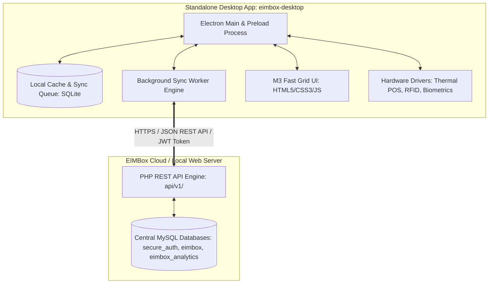

# EIMBox Desktop Platform & IDE — Master Architectural Blueprint & Roadmap

> **Document Classification:** Production Master Specification & Implementation Blueprint  
> **Project Target:** EIMBox Desktop Studio / Institute Terminal (Standalone Electron App)  
> **Backend Service:** EIMBox Core PHP REST API Engine (`api/v1/`)  
> **Purpose:** 100% self-contained technical documentation containing complete database schemas, API contracts, sync algorithms, hardware bridge protocols, and step-by-step development phases.

---

## ১. আর্কিটেকচারাল সারসংক্ষেপ (Architectural Summary)



---

## ২. ডেটাবেস রেফারেন্স ও মূল টেবিল স্ট্রাকচার (Central MySQL Schema Mapping)

### ১. অথেনটিকেশন ও স্কুল প্রোফাইল (Auth & Institute)
- **`usersapp` (ব্যবহারকারী তথ্য ও সিকিউরিটি):**
  - `id` (INT PK), `email` (VARCHAR), `username` (VARCHAR), `password_hash` (VARCHAR BCRYPT), `sccode` (INT - School Code), `profilename` (VARCHAR), `mobile` (VARCHAR), `userlevel` (VARCHAR: Super Administrator, Administrator, Teacher, Accountants, etc.), `admin` (TINYINT: 0-5), `is_chief` (TINYINT), `mfa_enabled` (TINYINT), `mfa_secret` (VARCHAR), `failed_attempts` (INT), `lock_until` (DATETIME), `remember_token_hash` (VARCHAR).
- **`scinfo` (প্রতিষ্ঠান কনফিগারেশন ও পেমেন্ট গেটওয়ে):**
  - `sccode` (INT PK), `scname` (VARCHAR), `sccategory` (VARCHAR), `scadd1`, `scadd2`, `ps`, `dist`, `mobile`, `rootuser`, `package_id`, `package_name`, `tier`, `sms_gateway`, `bkash`, `nagad`, `rocket`, `bank`, `valid_module`, `active_module`.

### ২. একাডেমিক স্ট্রাকচার ও শিক্ষার্থী (Academics & Students)
- **`areas` (ক্লাস ও সেকশন চেইন):**
  - `id` (INT PK), `sccode` (INT), `slot` (VARCHAR: Morning, Day), `sessionyear` (INT: 2026), `areaname` (VARCHAR: Class 6, Class 7), `subarea` (VARCHAR: Section A, Section B), `classteacher` (INT: Teacher ID).
- **`subjects` (বিষয় তালিকা ও মূল্যায়ন পলিসি):**
  - `id` (INT PK), `sccode` (INT), `classname` (VARCHAR), `subcode` (INT), `subname` (VARCHAR), `subtype` (Compulsory, Optional), `fullmarks` (INT), `passmarks` (INT).
- **`students` (শিক্ষার্থী ডিরেক্টরি):**
  - `stid` (VARCHAR PK - Student ID), `sccode` (INT), `sessionyear` (INT), `classname` (VARCHAR), `sectionname` (VARCHAR), `rollno` (INT), `stnameeng` (VARCHAR), `stnameben` (VARCHAR), `guarmobile` (VARCHAR), `previll` (VARCHAR), `dob` (DATE), `gender` (VARCHAR), `status` (Active, Inactive).

### ৩. পরীক্ষা ও ফলাফল (Examinations & Marks)
- **`examlist` (পরীক্ষা সূচি):**
  - `id` (INT PK), `sccode` (INT), `sessionyear` (INT), `examtitle` (VARCHAR: First Term, Half Yearly, Annual), `slot` (VARCHAR), `datestart` (DATE), `result_publish` (DATE).
- **`stmark` (শিক্ষার্থীর বিষয়ভিত্তিক নম্বর):**
  - `id` (INT PK), `sccode` (INT), `sessionyear` (INT), `exam` (VARCHAR), `classname` (VARCHAR), `sectionname` (VARCHAR), `subcode` (INT), `stid` (VARCHAR), `rollno` (INT), `subj` (DECIMAL), `obj` (DECIMAL), `prac` (DECIMAL), `ca` (DECIMAL), `total` (DECIMAL), `gp` (DECIMAL), `gl` (VARCHAR).
- **`tabulatingsheet` (ফলাফল টেবুলেশন ও ট্রান্সক্রিপ্ট):**
  - `id` (INT PK), `sccode` (INT), `sessionyear` (INT), `exam` (VARCHAR), `classname` (VARCHAR), `sectionname` (VARCHAR), `stid` (VARCHAR), `rollno` (INT), `totalmarks` (DECIMAL), `gpa` (DECIMAL), `gla` (VARCHAR), `avgrate` (DECIMAL), `failedsubjects` (INT), `position` (INT).

### ৪. হিসাব ও ফি কালেকশন (Finance, Fees & Cashbook)
- **`stfinance` (শিক্ষার্থী ফি নির্ধারণ ও কালেকশন ট্র্যাকিং):**
  - `id` (INT PK), `sccode` (INT), `sessionyear` (INT), `stid` (VARCHAR), `classname` (VARCHAR), `sectionname` (VARCHAR), `rollno` (INT), `itemid` (INT), `itemtitle` (VARCHAR), `amount` (DECIMAL), `paid` (DECIMAL), `due` (DECIMAL), `waiver` (DECIMAL), `fine` (DECIMAL), `prno` (VARCHAR - Money Receipt No), `prdate` (DATETIME).
- **`finanaceitem` (ফি হেড তালিকা):**
  - `id` (INT PK), `sccode` (INT), `itemid` (INT), `itemtitle` (VARCHAR: Monthly Tuition, Admission Fee, Exam Fee), `amount` (DECIMAL), `sessionyear` (INT).

### ৫. হাজিরা (Attendance System)
- **`stattnd` (দৈনিক শিক্ষার্থী হাজিরা):**
  - `id` (INT PK), `sccode` (INT), `sessionyear` (INT), `classname` (VARCHAR), `sectionname` (VARCHAR), `stid` (VARCHAR), `rollno` (INT), `adate` (DATE), `yn` (TINYINT: 1=Present, 0=Absent), `period` (INT), `in_time` (TIME), `out_time` (TIME).

---

## ৩. ব্যাকএন্ড এপিআই স্পেসিফিকেশন (Core REST API Contract: `api/v1/`)

সার্ভারের ব্যাকএন্ডে নিম্নোক্ত এন্ডপয়েন্টগুলো থাকবে (`eimbox-materio/api/v1/`):

### ১. অথেনটিকেশন ও ডিভাইস রেজিস্ট্রেশন (`api/v1/auth/`)
| Endpoint | Method | Payload | Response | বিবরণ |
| :--- | :---: | :--- | :--- | :--- |
| `login.php` | `POST` | `{ email, password, hw_uuid, mac_addr }` | `{ status: 'success', token, refresh_token, user, school }` | ইউজার লগইন ও ডিভাইস ভ্যালিডেশন |
| `mfa-verify.php` | `POST` | `{ temp_token, otp_code }` | `{ status: 'success', token, user }` | ২য় স্তর ইমেইল/এসএমএস OTP ভেরিফিকেশন |
| `device-bind.php` | `POST` | `{ sccode, hw_uuid, device_name }` | `{ status: 'authorized', device_id }` | স্কুল কম্পিউটারের হার্ডওয়্যার লক অনুমোদন |

### ২. একাডেমিক ও ডেটা সিঙ্ক (`api/v1/academics/` & `api/v1/sync/`)
| Endpoint | Method | Payload | Response | বিবরণ |
| :--- | :---: | :--- | :--- | :--- |
| `structure.php` | `GET` | `?sccode=103187` | `{ slots, classes, sections, subjects, exams }` | সম্পূর্ণ একাডেমিক ট্রি ডাউনলোড |
| `students-pull.php` | `GET` | `?sccode=103187&session=2026&class=6` | `[ { stid, rollno, name, photo, dues } ]` | নির্দিষ্ট ক্লাসের শিক্ষার্থী তালিকা |
| `delta-pull.php` | `GET` | `?sccode=103187&last_sync_timestamp=...` | `{ updated_marks, updated_payments, changes }` | শুধুমাত্র নতুন ডেটা সিঙ্ক |
| `batch-push.php` | `POST` | `{ sccode, transactions: [ ... ] }` | `{ status: 'success', synced_count, conflicts }` | অফলাইনে জমাকৃত ডেটা ব্যাচ আপলোড |

### ৩. দ্রুত ফি কালেকশন ও পিওএস কাউন্টার (`api/v1/finance/`)
| Endpoint | Method | Payload | Response | বিবরণ |
| :--- | :---: | :--- | :--- | :--- |
| `student-dues.php` | `GET` | `?sccode=103187&stid=1031870101` | `{ student, payable_items, total_due }` | বকেয়া ও বর্তমান ফি লোড |
| `collect-fee.php` | `POST` | `{ sccode, stid, items: [ { itemid, paid, waiver } ], prno }` | `{ status: 'success', receipt_id, print_payload }` | রসিদ জেনারেট ও পেমেন্ট রেকর্ড |

### ৪. মার্কস এন্ট্রি ও হাজিরা (`api/v1/exams/` & `api/v1/attendance/`)
| Endpoint | Method | Payload | Response | বিবরণ |
| :--- | :---: | :--- | :--- | :--- |
| `mark-entry-bulk.php` | `POST` | `{ sccode, session, exam, subcode, marks: [ { stid, subj, obj, prac } ] }` | `{ status: 'success', processed }` | গ্রিড মার্কস একবারে সেভ |
| `attendance-push.php` | `POST` | `{ sccode, date, records: [ { stid, status, in_time } ] }` | `{ status: 'success', recorded }` | বায়োমেট্রিক/ম্যানুয়াল হাজিরা পুশ |

---

## ৪. নতুন ডেস্কটপ প্রজেক্ট স্ট্রাকচার (Standalone Desktop Workspace: `eimbox-desktop/`)

```
eimbox-desktop/
│
├── package.json                     # Electron, better-sqlite3, escpos, electron-builder
├── main.js                          # Main Electron Process (Window Lifecycle, IPC Handlers)
├── preload.js                       # Secure Context Bridge (API, Database, Hardware exposed to UI)
│
├── build/                           # Build assets
│   ├── icon.ico                     # Windows App Icon
│   └── installer.nsh                # NSIS Custom Installer script
│
├── src/
│   ├── core/                        # Engine Logic
│   │   ├── config.js                # API Base URLs, App Settings, Version
│   │   ├── database.js              # Local SQLite Database Wrapper (better-sqlite3)
│   │   ├── sync-engine.js           # Background Offline Sync Worker & Poller
│   │   ├── api-client.js            # Axios / Fetch HTTP Wrapper with Token Interceptor
│   │   └── security.js              # Hardware UUID generator (Machine ID + MAC)
│   │
│   ├── hardware/                    # Hardware Integration Drivers
│   │   ├── thermal-printer.js       # ESC/POS Direct Print (58mm/80mm USB & Network)
│   │   ├── barcode-scanner.js       # HID / Serial Scanner Listener
│   │   └── biometric-bridge.js      # ZKTeco / Biometric attendance sync bridge
│   │
│   └── ui/                          # Frontend User Interface (Material 3)
│       ├── index.html               # Main Terminal Shell (Sidebar + Content Container)
│       ├── assets/
│       │   ├── css/
│       │   │   ├── m3-theme.css     # Google Material 3 Design Tokens (Light/Dark)
│       │   │   ├── grid-editor.css  # Fast Excel-Style Data Entry Grid
│       │   │   └── components.css   # Modals, Badges, Tables, Toast Notifications
│       │   ├── js/
│       │   │   ├── router.js        # Single Page Application (SPA) Page Router
│       │   │   ├── app.js           # Global State Management & UI Lifecycle
│       │   │   └── hotkeys.js       # Global IDE-style Keyboard Shortcuts Handler
│       │   └── fonts/ & icons/
│       │
│       └── views/                   # Terminal Screens
│           ├── login.html           # Secure User Login & Device Registration
│           ├── pos-counter.html     # Superfast One-Click Fee Collection Counter
│           ├── marks-grid.html      # Ultra-Fast Keyboard-First Marks Entry Grid
│           ├── live-attendance.html # Live Biometric & RFID Attendance Monitor
│           ├── settings.html        # Printer Setup, API URL, Sync Interval Config
│           └── sync-monitor.html    # Offline Queue & Sync Diagnostics
│
└── desktop-ide.md                   # This Master Blueprint (Single Source of Truth)
```

---

## ৫. লোকাল অফলাইন ডেটাবেস স্কিমা (Desktop Local SQLite Engine)

```sql
-- ১. অফলাইন ট্রানজেকশন কিউ টেবিল
CREATE TABLE IF NOT EXISTS offline_sync_queue (
    queue_id INTEGER PRIMARY KEY AUTOINCREMENT,
    sccode INTEGER NOT NULL,
    module_name TEXT NOT NULL,
    action_type TEXT NOT NULL,       -- 'INSERT', 'UPDATE', 'DELETE'
    endpoint TEXT NOT NULL,          -- e.g., '/api/v1/finance/collect-fee.php'
    payload_json TEXT NOT NULL,
    created_at DATETIME DEFAULT CURRENT_TIMESTAMP,
    sync_status TEXT DEFAULT 'pending', -- 'pending', 'syncing', 'synced', 'failed'
    retry_count INTEGER DEFAULT 0,
    error_message TEXT
);

-- ২. লোকাল ক্যাশড শিক্ষার্থী তালিকা
CREATE TABLE IF NOT EXISTS local_students (
    stid TEXT PRIMARY KEY,
    sccode INTEGER NOT NULL,
    sessionyear INTEGER,
    classname TEXT,
    sectionname TEXT,
    rollno INTEGER,
    name TEXT,
    guarmobile TEXT,
    due_amount REAL DEFAULT 0,
    photo_path TEXT,
    updated_at DATETIME
);

-- ৩. লোকাল সিস্টেম কনফিগারেশন
CREATE TABLE IF NOT EXISTS local_config (
    config_key TEXT PRIMARY KEY,
    config_value TEXT
);
```

---

## ৬. হার্ডওয়্যার ও ডিরেক্ট পিওএস রসিদ প্রিন্টিং প্রোটোকল (ESC/POS Printing)

```javascript
// Sample Thermal Print Receipt Logic (thermal-printer.js)
const { ThermalPrinter, PrinterTypes } = require('node-thermal-printer');

async function printFeeReceipt(receiptData) {
    const printer = new ThermalPrinter({
        type: PrinterTypes.EPSON,
        interface: receiptData.printer_interface || '//localhost/POS-80',
        characterSet: 'SLOVENIA',
        removeSpecialCharacters: false
    });

    printer.alignCenter();
    printer.bold(true);
    printer.setTextSize(1, 1);
    printer.println(receiptData.school_name);
    printer.bold(false);
    printer.setTextSize(0, 0);
    printer.println(receiptData.school_address);
    printer.println(`Phone: ${receiptData.school_mobile}`);
    printer.drawLine();

    printer.alignLeft();
    printer.println(`Receipt No: ${receiptData.prno}`);
    printer.println(`Date: ${receiptData.prdate}`);
    printer.println(`Student: ${receiptData.stname} (ID: ${receiptData.stid})`);
    printer.println(`Class: ${receiptData.classname} | Roll: ${receiptData.rollno}`);
    printer.drawLine();

    printer.tableCustom([
        { text: "Item", align: "LEFT", width: 0.6 },
        { text: "Amount (Tk)", align: "RIGHT", width: 0.4 }
    ]);

    receiptData.items.forEach(item => {
        printer.tableCustom([
            { text: item.title, align: "LEFT", width: 0.6 },
            { text: Number(item.paid).toFixed(2), align: "RIGHT", width: 0.4 }
        ]);
    });

    printer.drawLine();
    printer.alignRight();
    printer.bold(true);
    printer.println(`Total Paid: Tk ${Number(receiptData.total_paid).toFixed(2)}`);
    printer.bold(false);

    printer.alignCenter();
    printer.printQR(receiptData.verify_url);
    printer.println("Thank you for paying on time!");
    printer.cut();

    await printer.execute();
}
```

---

## ৭. কীবোর্ড শর্টকাট ও আইডিই গ্রিড স্পেসিফিকেশন (Fast IDE Hotkeys)

| Shortcut Key | Action | Context |
| :--- | :--- | :--- |
| `Ctrl + F` | দ্রুত শিক্ষার্থী সার্চ (Search Student by ID / Roll / Mobile) | POS Counter / Global |
| `Enter` | বর্তমান ইনপুট সেভ করে নিচের রো-তে যাওয়া | Marks Entry Grid |
| `Tab / Shift+Tab` | পরবর্তী ফিল্ডে / আগের ফিল্ডে মুভ করা | Marks / Form Entry |
| `Ctrl + P` | সরাসরি ক্যাশ রসিদ প্রিন্ট করা (Direct POS Print) | POS Counter |
| `Ctrl + S` | সম্পূর্ণ গ্রিড অফলাইন/অনলাইন সেভ করা | Marks / Attendance |
| `F5` | ম্যানুয়াল ফোর্স সিঙ্ক (Force Delta Sync with Server) | Global |
| `Esc` | কোনো খোলা মডাল বা ড্রপডাউন ক্লোজ করা | Global |

---

## ৮. বাস্তবায়ন পরিকল্পনা (Execution Roadmap)

```
[Phase 1] Backend Core API Engine (`api/v1/`)
          ├── api/v1/auth/ (login, mfa, device-bind)
          ├── api/v1/academics/ (structure, subjects)
          ├── api/v1/finance/ (dues, collect-fee)
          └── api/v1/sync/ (batch-push, delta-pull)

[Phase 2] Desktop Shell & Project Setup (`eimbox-desktop/`)
          ├── package.json (Electron, electron-builder, sqlite)
          ├── main.js, preload.js, Security Bridge
          └── Local SQLite schema & sync-engine worker

[Phase 3] Ultra-Fast Operational Interfaces (M3 UI)
          ├── fast-pos.html (One-Click Fee Collection)
          ├── marks-grid.html (Excel-Style Keyboard Marks IDE)
          └── live-attendance.html (Biometric & RFID feed)

[Phase 4] Hardware Drivers Integration
          ├── ESC/POS Thermal Receipt direct printer driver
          └── Barcode/RFID scanner listener

[Phase 5] Offline Sync & Conflict Handling
          ├── Automatic background delta sync
          └── Network recovery queue flush & conflict tests

[Phase 6] Packaging, Auto-Updater & Installer (.exe)
          ├── electron-builder NSIS installer generation (`.exe`)
          └── In-App background auto-updater setup
```

---

## ৯. নতুন প্রজেক্টে শুরুর নির্দেশিকা (New Project Quickstart Guide)

যখন আপনি নতুন ফোল্ডারে (যেমন: `eimbox-desktop`) নতুন প্রজেক্ট হিসেবে কাজ শুরু করবেন:

### ১. নতুন প্রজেক্ট এনভায়রনমেন্ট কনফিগারেশন:
- **Backend API Base URL (Local Dev):**  
  `http://localhost/eimbox-dashboard/eimbox-materio/api/v1`
- **Backend API Base URL (Production Live):**  
  `https://eimbox.com/api/v1`
- **প্রয়োজনীয় NPM প্যাকেজসমূহ:**
  ```json
  {
    "dependencies": {
      "axios": "^1.7.0",
      "better-sqlite3": "^11.0.0",
      "node-machine-id": "^1.1.12",
      "node-thermal-printer": "^4.4.0"
    },
    "devDependencies": {
      "electron": "^31.0.0",
      "electron-builder": "^24.13.0",
      "electron-reload": "^2.0.0-motebaya"
    }
  }
  ```

### ২. নতুন প্রজেক্টের প্রথম প্রম্পট (First Execution Prompt):
নতুন প্রজেক্টের উইন্ডোতে গিয়ে [desktop-ide.md](file:///d:/XAMPP/htdocs/eimbox-dashboard/eimbox-materio/desktop-ide.md) পেস্ট করে কেবল নিচের প্রম্পটটি দিন:

> **"desktop-ide.md ফাইলের নির্দেশনা অনুযায়ী eimbox-desktop প্রজেক্টের Phase 1 (Electron Shell, Auth & Academic Cache) তৈরি করে লাইভ রান করো।"**

---

## ১০. ফেজ ১ ডেস্কটপ ডেলিভারেবলস চেকলিস্ট (Phase 1 Deliverables)

- [ ] `package.json` তৈরি এবং Electron ডিপেনডেন্সি ইনস্টল।
- [ ] `main.js` এবং `preload.js` (সিকিউর আইপিসি ব্রিজ)।
- [ ] `src/core/config.js` (লোকালহোস্ট ও প্রোডাকশন API URL সুইচিং)।
- [ ] `src/core/database.js` (লোকাল SQLite ইনিশিয়ালাইজেশন ও টেবিল অটো-ক্রিয়েশন)।
- [ ] `src/core/api-client.js` (Bearer Token যুক্ত করে সার্ভারে কল করার ক্লায়েন্ট)।
- [ ] `src/ui/views/login.html` ও `src/ui/assets/css/m3-theme.css` (মেটেরিয়াল ৩ ডিজাইনের আধুনিক লগইন ইন্টারফেস)।
- [ ] সার্ভারের `api/v1/auth/login.php` কল করে লাইভ লগইন ও একাডেমিক ডেটা লোকাল SQLite-এ ক্যাশ করা।
- [ ] `npm start` চালিয়ে সরাসরি উইন্ডোজ অ্যাপ চালু ও টেস্ট করা।

---
*Blueprint Generated & Validated for EIMBox Educational Management System.*
