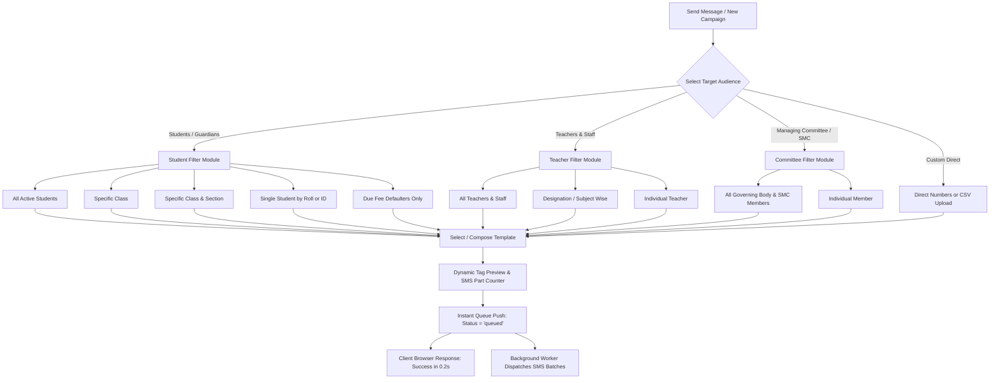

# EIMBox Advanced Messaging & SMS Queue Engine — Complete System Blueprint

> **Document Status:** Architectural Master Plan & Implementation Specification  
> **Target Platforms:** Web (PHP 8+, MySQLi, Material Design 3), Desktop (Electron / SQLite), Mobile (Android Jetpack Compose)  
> **Multi-Tenant Rule:** All database operations, logs, and templates are strictly scoped with `WHERE sccode = ?`.

---

## ১. সিস্টেম ভিশন ও প্রধান উদ্দেশ্যসমূহ (System Overview & Goals)

EIMBox শিক্ষা ব্যবস্থাপনা সিস্টেমে এসএমএস এবং নোটিফিকেশন ইঞ্জিনকে একটি আধুনিক, দ্রুতগতির এবং নির্ভরযোগ্য প্ল্যাটফর্মে রূপান্তর করা।

### প্রধান লক্ষ্যসমূহ:
1. **JSON ডেটা আর্কিটেকচার:** পুরনো ভঙ্গুর পাইপ সেপারেটর (`|`) দূর করে সম্পূর্ণ JSON কী-ভ্যালু ভিত্তিক স্টোরেজ চালু করা।
2. **ব্যাকগ্রাউন্ড কিউ ও ব্রাউজার-মুক্ত ডিসপ্যাচ:** ব্যবহারকারী ৫০০-১০০০+ মেসেজ পাঠিয়ে ০.২ সেকেন্ডে কনফার্মেশন পাবেন এবং ব্রাউজার বন্ধ করে দিলেও সার্ভার ব্যাকগ্রাউন্ডে স্বয়ংক্রিয়ভাবে মেসেজ পাঠাবে।
3. **মাল্টি-রোল অডিয়েন্স সিলেকশন:** শিক্ষার্থী (সকল/শ্রেণি/শাখা/একক), অভিভাবক, শিক্ষক ও কর্মকর্তা, ম্যানেজিং কমিটি/SMC এবং কাস্টম নাম্বারে সহজে মেসেজ পাঠানো।
4. **ডাইনামিক ভ্যারিয়েবল ও টেমপ্লেট লাইব্রেরি:** উপস্থিতি, বকেয়া, ফি আদায়, রেজাল্ট, মিটিং ও নোটিশের জন্য প্রি-বিল্ট টেমপ্লেট ও লাইভ ট্যাগ রিপ্লেসমেন্ট।
5. **জিরো-কস্ট স্যান্ডবক্স মোড (Sandbox / Mock Mode):** কোনো ব্যালেন্স খরচ না করে (০ টাকা খরচে) পুরো ১০০০ মেসেজের ব্যাকগ্রাউন্ড প্রসেসিং টেস্ট করার সুবিধা।

---

## ২. পাইপ (`|`) থেকে JSON আর্কিটেকচারে রূপান্তর

### ২.১ কনফিগারেশন রূপান্তর ম্যাপিং (`scinfo` টেবিল)
`scinfo` টেবিলের `sms_gateway`, `sms_in`, `sms_out`, `sms_absent`, `sms_payment`, `sms_dues`, `sms_month_report` কলামগুলোতে এখন নিচের মতো সুবিন্যস্ত JSON ডেটা সংরক্ষিত হবে:

#### উদাহরণ: `sms_gateway` JSON Structure
```json
{
  "enabled": 1,
  "provider": "bulksmsbd",
  "api_key": "YOUR_API_KEY_HERE",
  "secret_key": "YOUR_SECRET_KEY_HERE",
  "username": "YOUR_SENDER_ID",
  "password": "",
  "uri": "http://bulksmsbd.net/api/smsapi",
  "price": 0.35,
  "sandbox_mode": 0,
  "masking": 0
}
```

#### উদাহরণ: `sms_absent` (অনুপস্থিতি অটোমেশন সেটিংস) JSON Structure
```json
{
  "enabled": 1,
  "priority_1": "on_submit",
  "priority_2": "after_1st_period",
  "priority_3": "on_time",
  "fixed_time": "11:30",
  "template_id": 3,
  "template_text": "সম্মানিত অভিভাবক, আপনার সন্তান [[STUDENT_NAME]] আজ [[DATE]] বিদ্যালয়ে অনুপস্থিত। - [[INSTITUTE_NAME]]"
}
```

### ২.২ ব্যাকওয়ার্ড কম্প্যাটিবিলিটি হেল্পার (Legacy Fallback)
পুরোনো পাইপ ডেটা যেন ক্র্যাশ না করে, সেজন্য সেন্ট্রাল হেল্পার ফাংশন:
```php
function get_sms_setting($raw_data, $type = 'gateway') {
    if (empty($raw_data)) return [];
    
    $json = json_decode($raw_data, true);
    if (json_last_error() === JSON_ERROR_NONE && is_array($json)) {
        return $json;
    }
    
    // Legacy pipe fallback
    $p = explode(' | ', trim($raw_data));
    if ($type === 'gateway') {
        return [
            'enabled'      => intval($p[0] ?? 0),
            'api_key'      => $p[1] ?? '',
            'secret_key'   => $p[2] ?? '',
            'username'     => $p[3] ?? '',
            'password'     => $p[4] ?? '',
            'uri'          => $p[5] ?? '',
            'provider'     => $p[6] ?? 'bulksmsbd',
            'price'        => floatval($p[7] ?? 0.35),
            'sandbox_mode' => 0
        ];
    }
    
    return [
        'enabled'       => intval($p[0] ?? 0),
        'priority_1'    => $p[1] ?? '',
        'priority_2'    => $p[2] ?? '',
        'priority_3'    => $p[3] ?? '',
        'fixed_time'    => $p[4] ?? '',
        'template_text' => $p[5] ?? ''
    ];
}
```

---

## ৩. ডেটাবেজ স্কিমা পরিবর্তন ও মাইগ্রেশন স্ক্রিপ্ট (Database Migration)

### ৩.১ `sms_templete` টেবিল আপডেট (ALTER SQL)
```sql
-- ১. টেক্সটের সাইজ বৃদ্ধি ও ডেটা টাইপ রিফাইন
ALTER TABLE `sms_templete` 
  MODIFY `temp_type` VARCHAR(50) NOT NULL DEFAULT 'general',
  MODIFY `temp_text` TEXT NOT NULL;

-- ২. নতুন ফিচার কলামসমূহ যুক্ত করা
ALTER TABLE `sms_templete`
  ADD COLUMN `target_audience` ENUM('all', 'student', 'guardian', 'teacher', 'committee', 'custom') DEFAULT 'student' AFTER `temp_type`,
  ADD COLUMN `language` ENUM('bn', 'en') DEFAULT 'bn' AFTER `temp_text`,
  ADD COLUMN `available_tags` TEXT NULL COMMENT 'JSON array of supported variable tags' AFTER `language`,
  ADD COLUMN `is_default` TINYINT(1) DEFAULT 0 COMMENT '1 = System Default Preset' AFTER `available_tags`,
  ADD COLUMN `status` TINYINT(1) DEFAULT 1 COMMENT '1 = Active, 0 = Inactive' AFTER `is_default`,
  ADD COLUMN `updated_time` DATETIME ON UPDATE CURRENT_TIMESTAMP AFTER `created_time`;

-- ৩. অপ্টিমাইজড ইনডেক্স
ALTER TABLE `sms_templete`
  ADD INDEX `idx_sccode_audience` (`sccode`, `target_audience`, `status`);
```

### ৩.২ `sms` (Queue & Log) টেবিল আপডেট (ALTER SQL)
```sql
-- ১. ফিল্ড সাইজ বৃদ্ধি (গেটওয়ে রেসপন্স ও বার্তা ধারণের জন্য)
ALTER TABLE `sms`
  MODIFY `mobile_number` VARCHAR(20) NOT NULL,
  MODIFY `sms_text` TEXT NOT NULL,
  MODIFY `campaign` VARCHAR(100) DEFAULT 'Regular',
  MODIFY `message_id` VARCHAR(100) NULL,
  MODIFY `success_message` TEXT NULL,
  MODIFY `error_message` TEXT NULL,
  MODIFY `status` VARCHAR(20) DEFAULT 'queued' COMMENT 'queued, sending, sent, delivered, failed';

-- ২. ব্যাকগ্রাউন্ড কিউ ও মাল্টি-অডিয়েন্স ট্র্যাকিং কলামসমূহ
ALTER TABLE `sms`
  ADD COLUMN `recipient_type` ENUM('student', 'guardian', 'teacher', 'committee', 'staff', 'custom') DEFAULT 'guardian' AFTER `sessionyear`,
  ADD COLUMN `recipient_id` VARCHAR(50) NULL COMMENT 'Student stid, Teacher tid, Member ID' AFTER `recipient_type`,
  ADD COLUMN `recipient_name` VARCHAR(150) NULL AFTER `recipient_id`,
  ADD COLUMN `classname` VARCHAR(50) NULL AFTER `recipient_name`,
  ADD COLUMN `sectionname` VARCHAR(50) NULL AFTER `classname`,
  ADD COLUMN `rollno` INT NULL AFTER `sectionname`,
  ADD COLUMN `sms_parts` INT NOT NULL DEFAULT 1 COMMENT 'Charge multiplier' AFTER `sms_len`,
  ADD COLUMN `is_unicode` TINYINT(1) DEFAULT 1 COMMENT '1 = Bengali (70 chars), 0 = English (160 chars)' AFTER `sms_parts`,
  ADD COLUMN `gateway_provider` VARCHAR(50) DEFAULT 'bulksmsbd' AFTER `is_unicode`,
  ADD COLUMN `batch_id` VARCHAR(64) NULL COMMENT 'UUID for Bulk Send Batches' AFTER `status`,
  ADD COLUMN `delivered_time` DATETIME NULL AFTER `send_time`;

-- ৩. কিউ ও পারফরম্যান্স ইনডেক্স
ALTER TABLE `sms`
  ADD INDEX `idx_queue_status` (`status`, `sccode`),
  ADD INDEX `idx_batch_id` (`batch_id`),
  ADD INDEX `idx_date_type` (`sccode`, `date`, `sms_type`);
```

---

## ৪. টার্গেট অডিয়েন্স ম্যাট্রিক্স ও সিলেকশন ওয়ার্কফ্লো

মেসেজিং ড্যাশবোর্ড থেকে ইউজার খুব সহজে টার্গেট অডিয়েন্স নির্বাচন করতে পারবেন:



---

## ৫. ডাইনামিক ভ্যারিয়েবল ও টেমপ্লেট লাইব্রেরি

### ৫.১ ট্যাগ ডিকশনারি (Tag Dictionary)
| ট্যাগ | বিবরণ | স্যাম্পল আউটপুট |
| :--- | :--- | :--- |
| `[[INSTITUTE_NAME]]` | প্রতিষ্ঠানের নাম | উদয়ন উচ্চ মাধ্যমিক বিদ্যালয় |
| `[[STUDENT_NAME]]` | শিক্ষার্থীর নাম | লাবিব শাহরিয়ার |
| `[[CLASS_NAME]]` | শ্রেণি | নবম |
| `[[SECTION_NAME]]` | শাখা | পদ্মা |
| `[[ROLL_NO]]` | রোল নম্বর | ১২ |
| `[[GUARDIAN_NAME]]` | অভিভাবকের নাম | মোঃ আবদুস সাত্তার |
| `[[DUE_AMOUNT]]` | সর্বমোট বকেয়া | ১,২৫০.০০ |
| `[[PAID_AMOUNT]]` | পরিশোধিত টাকা | ৫০০.০০ |
| `[[RECEIPT_NO]]` | মানি রিসিট নং | MR-2026-0891 |
| `[[MONTH_NAME]]` | মাসের নাম | সেপ্টেম্বর |
| `[[DATE]]` / `[[TIME]]` | তারিখ / সময় | 26-09-2026 / 08:30 AM |
| `[[EXAM_NAME]]` | পরীক্ষার নাম | বার্ষিক পরীক্ষা ২০২৬ |
| `[[GPA_GRADE]]` | জিপিএ ও গ্রেড | GPA: 5.00 (A+) |
| `[[TEACHER_NAME]]` | শিক্ষকের নাম | রফিকুল ইসলাম |
| `[[MEETING_TIME]]` | সভার সময় ও স্থান | সকাল ১০:০০ ঘটিকায় (শিক্ষক মিলনায়তন) |

### ৫.২ প্রি-ডিজাইনড টেমপ্লেটসমূহ (Preset Templates)
1. **উপস্থিতি (In-Time):**  
   `প্রিয় অভিভাবক, আপনার সন্তান [[STUDENT_NAME]] (শ্রেণি: [[CLASS_NAME]], রোল: [[ROLL_NO]]) আজ [[TIME]] ঘটিকায় বিদ্যালয়ে উপস্থিত হয়েছে। - [[INSTITUTE_NAME]]`
2. **অনুপস্থিতি (Absence):**  
   `সম্মানিত অভিভাবক, আপনার সন্তান [[STUDENT_NAME]] (শ্রেণি: [[CLASS_NAME]], রোল: [[ROLL_NO]]) আজ [[DATE]] বিদ্যালয়ে অনুপস্থিত। অনুপস্থিতির কারণ অবগত করার অনুরোধ রইল। - [[INSTITUTE_NAME]]`
3. **ফি আদায় (Payment Receipt):**  
   `ধন্যবাদ। [[STUDENT_NAME]] এর [[MONTH_NAME]] মাসের ফি বাবদ [[PAID_AMOUNT]] টাকা গৃহীত হয়েছে (রশিদ নং: [[RECEIPT_NO]])। - [[INSTITUTE_NAME]]`
4. **বকেয়া নোটিশ (Due Reminder):**  
   `সম্মানিত অভিভাবক, [[STUDENT_NAME]] এর [[MONTH_NAME]] মাস পর্যন্ত মোট [[DUE_AMOUNT]] টাকা বকেয়া রয়েছে। নির্ধারিত সময়ের মধ্যে পরিশোধের অনুরোধ করা হলো। - [[INSTITUTE_NAME]]`
5. **পরীক্ষার ফলাফল (Exam Result):**  
   `[[EXAM_NAME]] ফলাফল: [[STUDENT_NAME]], শ্রেণি: [[CLASS_NAME]], রোল: [[ROLL_NO]], প্রাপ্ত ফলাফল: [[GPA_GRADE]]। বিস্তারিত মার্কশিট ওয়েবসাইটে দেখুন। - [[INSTITUTE_NAME]]`
6. **শিক্ষক সাধারণ সভা (Teachers Meeting):**  
   `শ্রদ্ধেয় শিক্ষক/শিক্ষিকা মহোদয়, আগামী [[DATE]] [[MEETING_TIME]] জরুরি একাডেমিক সভা অনুষ্ঠিত হবে। আপনার উপস্থিতি একান্ত কাম্য। - অধ্যক্ষ, [[INSTITUTE_NAME]]`
7. **ম্যানেজিং কমিটি সভা (SMC Meeting):**  
   `সম্মানিত সদস্য, ম্যানেজিং কমিটির নিয়মিত মাসিক সভা আগামী [[DATE]] [[MEETING_TIME]] সভাকক্ষে অনুষ্ঠিত হবে। যথাসময়ে উপস্থিত থাকার জন্য বিনীত অনুরোধ রইল। - সভাপতি/প্রধান শিক্ষক`

---

## ৬. ব্যাকগ্রাউন্ড কিউ ও ডিসপ্যাচার ইঞ্জিন (Zero-Wait Execution)

### ৬.১ কার্যপদ্ধতি (How It Works):
1. **প্রডিউসার (Frontend Submission):**  
   ইউজার ১০০০ শিক্ষার্থীকে মেসেজ পাঠালে ফ্রন্টএন্ড থেকে একটি বাল্ক ইনসার্ট কুয়েরি দিয়ে সবগুলো মেসেজ `status = 'queued'` আকারে `sms` টেবিলে জমা হয়। সময় নেয় মাত্র **০.০৫ - ০.২ সেকেন্ড**। এরপর ইউজারকে সাকসেস মেসেজ দেখানো হয়।
2. **ডিটাচড ব্যাকগ্রাউন্ড ট্রিগার (Instant Async Process):**  
   রেসপন্স পাঠানোর সাথে সাথে সার্ভার ব্যাকগ্রাউন্ডে স্বাধীনভাবে `cron-job/sms-dispatcher.php` ট্রিগার করে (Windows এ `popen("start /B php...")`, Linux এ `exec("php ... > /dev/null 2>&1 &")`)। **ইউজার তাৎক্ষণিক ব্রাউজার বা কম্পিউটার বন্ধ করে দিলেও এই ব্যাকগ্রাউন্ড প্রসেস চলবে।**
3. **সার্ভার ক্রন জব ব্যাকআপ (Periodic Safety Net):**  
   সার্ভারে প্রতি ১ মিনিটে ক্রন জব শিডিউল করা থাকবে। কোনো কারণে কোনো মেসেজ পেন্ডিং থেকে গেলে ক্রন জব সেগুলোকে তুলে স্বয়ংক্রিয়ভাবে পাঠিয়ে দেবে।
4. **ব্যাচ প্রসেসিং ও মাল্টি-কার্ল (Batching & Rate Limit):**  
   একবারে ৫০টি করে মেসেজ প্যারালাল রিকোয়েস্টে পাঠানো হবে, যাতে গেটওয়ে ওভারলোড না হয়।
5. **লক ফাইল গার্ড (Concurrency Lock):**  
   একই সময়ে দুটি ব্যাকগ্রাউন্ড ওয়ার্কার যেন একই মেসেজ দুবার না পাঠায়, সেজন্য একটি এটোমিক লক ফাইল (`sys_get_temp_dir() . '/eimbox_sms_worker.lock'`) বজায় রাখা হবে।

---

## ৭. ডেভেলপার স্যান্ডবক্স ও টেস্টিং মোড (০ টাকা খরচে টেস্টিং)

বাস্তবে ১০০০ মেসেজ টেস্ট করতে যেন কোনো এসএমএস ব্যালেন্স নষ্ট না হয়, সেজন্য সিস্টেমে ৩টি টেস্টিং মোড অন্তর্ভুক্ত:

1. **স্যান্ডবক্স মোড (Sandbox / Mock Mode — খরচ: ০ টাকা):**
   * গেটওয়ে সেটিংসে `sandbox_mode = 1` দিলে ব্যাকগ্রাউন্ড ইঞ্জিন ১০০০টি মেসেজের পুরো কিউ প্রসেস করবে, লগে স্ট্যাটাস আপডেট করবে, কিন্তু কোনো রিয়েল গেটওয়ে এপিআই কল করবে না।
   * **সুবিধা:** ব্যাকগ্রাউন্ড কিউ, স্পিড ও ডেটাবেজ স্ট্যাটাস ১ পয়সা খরচ ছাড়াই নিখুঁতভাবে টেস্ট করা যাবে।
2. **সিঙ্গেল নাম্বার রিডাইরেক্ট মোড (Redirect to 1 Test Phone — খরচ: ৩৫ পয়সা):**
   * ১০০০ শিক্ষার্থীর জন্য ডাইনামিক মেসেজ তৈরি হবে, কিন্তু সবগুলোর মধ্যে শুধু ১টি মেসেজ ইউজারের নিজস্ব মোবাইল নাম্বারে আসবে (মেসেজের বাংলা ফন্ট ও লেআউট ফোনে দেখার জন্য)।
3. **স্মল ব্যাচ ফিল্টারিং (Small Batch — খরচ: ৭০ পয়সা):**
   * ফিল্টার থেকে নির্দিষ্ট ১-২ জন শিক্ষার্থী বা শিক্ষক সিলেক্ট করে রিয়েল টেস্ট করা।

---

## ৮. বাস্তবায়নের ক্রম ও রোডম্যাপ (Implementation Roadmap)

| ধাপ | কাজের বিবরণ | সংশ্লিষ্ট ফাইল |
| :--- | :--- | :--- |
| **Step 1** | ডেটাবেজ স্কিমা মাইগ্রেশন (ALTER Table রান করা) | `sms_templete.sql`, `sms.sql` |
| **Step 2** | সেন্ট্রাল হেল্পার ফাংশন ও JSON পার্সার তৈরি | `core/sms-var.php`, `core/functions.php` |
| **Step 3** | গেটওয়ে সেটিংস পেজ রি-ফ্যাক্টর (JSON Save/Load) | `sms-gateway.php`, `backend/save-sms-settings.php` |
| **Step 4** | ব্যাকগ্রাউন্ড ডিসপ্যাচার ও ক্রন ইঞ্জিন তৈরি | `cron-job/sms-dispatcher.php` |
| **Step 5** | স্যান্ডবক্স মোড ও টেস্ট টুল তৈরি | `cron-job/cron-heartbeat.php`, `cron-job/check-cron.php` |
| **Step 6** | পূর্ণাঙ্গ মেসেজিং ও অডিয়েন্স ড্যাশবোর্ড তৈরি | `messaging-send.php`, `sms-log.php` |
| **Step 7** | বাল্ক টেস্ট ও লাইভ ভেরিফিকেশন | Sandbox & Real Gateway Test |
